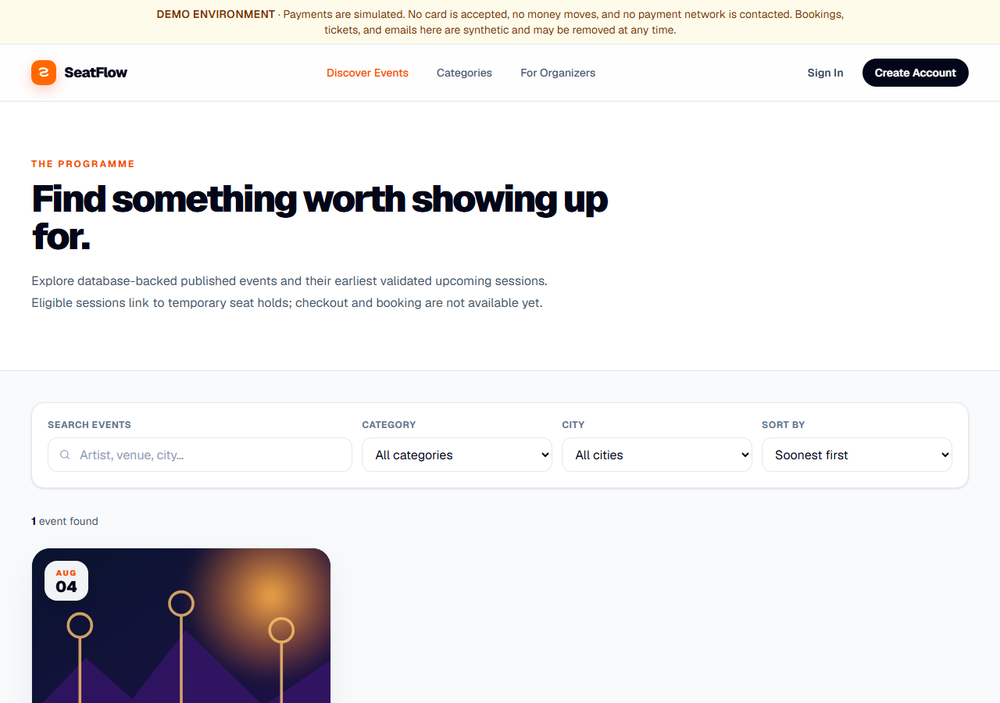
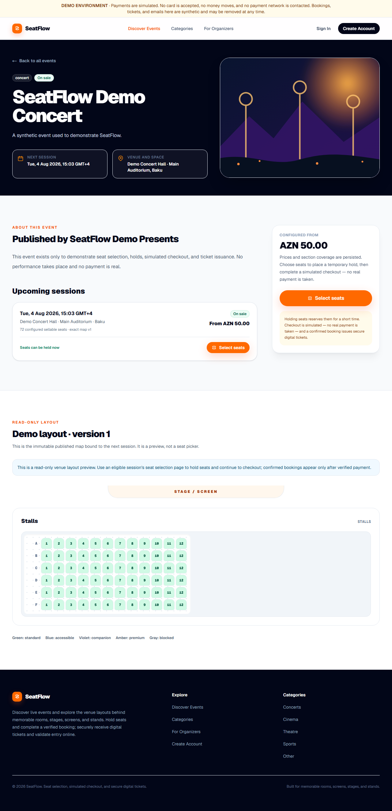
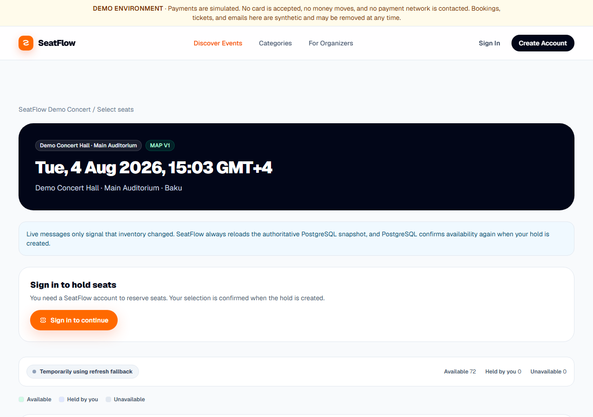

# SeatFlow

[](https://github.com/tahagurvardar/seatflow/actions/workflows/ci.yml)
[](https://seatflow-staging.vercel.app)
[](https://nextjs.org)
[](https://www.typescriptlang.org)
[](https://www.postgresql.org)
[](LICENSE)

SeatFlow is a production-oriented event-ticketing platform: multi-tenant venue and
event management, a live seat map, atomic seat holds, exact-once booking
fulfilment, secure digital tickets with entry scanning, and a complete refund,
dispute, ledger, and reconciliation layer.

It is built as a portfolio project, but it is not a toy. Seat authority lives in
PostgreSQL, money state changes only on a verified webhook, the financial ledger
is append-only and enforced by database triggers, and every relaxation granted to
a non-production environment has to *prove* it is not production.

**Live staging demo → <https://seatflow-staging.vercel.app>**

## ⚠️ Demo environment disclaimer

The live URL above is a **staging demo**, and every page says so in a
non-dismissible banner.

- **No real payment is possible.** Checkout uses the simulated `LOCAL_SIGNED`
  provider. No card is accepted, no money moves, and **no payment network is
  ever contacted**. There is no payment account of any kind attached to this
  project.
- **Email goes to exactly one approved test recipient.** Resend runs in test
  mode, so every message is redirected regardless of the intended address.
- **All data is synthetic** and may be removed at any time.
- Demo account passwords are **not** published here. They live only in an
  ignored local file chosen by the environment's owner.

## Architecture

Next.js App Router (React Server Components) with Server Actions for mutations,
Prisma over PostgreSQL as the single source of truth, and Redis used strictly as
an invalidation transport — never as seat, payment, or entry authority.

```text
Browser ── RSC / Server Actions ── PostgreSQL (authority)
                 │                      ▲
                 │                      │ triggers enforce ledger + refund caps
                 ├── Redis Streams ─────┘ (invalidation transport only)
                 ├── Payment provider boundary ── verified webhook ── money state
                 └── Outbox tables ── scheduled jobs (BullMQ workers *or* QStash)
```

Four deployment profiles are recognised and are **not** interchangeable:
`local`, `isolated-e2e`, `staging-demo`, and `production`. A profile that is
merely *claimed* but fails any of its conditions resolves to `production` — the
strictest world — so a misconfiguration fails closed.

### Technology stack

| Layer | Choice |
|---|---|
| Framework | Next.js 16 (App Router, RSC, Server Actions, Turbopack) |
| Language | TypeScript, strict |
| Database | PostgreSQL via Prisma 7 (Neon on staging) |
| Auth | Better Auth (email/password sessions) |
| Cache / transport | Redis 7 (Upstash on staging) |
| Scheduling | BullMQ workers, or Upstash QStash signed HTTP jobs |
| Email | Resend (test mode on staging), local file capture in development |
| Hosting | Vercel |
| Testing | Vitest (unit, component, server, integration), Playwright (browser) |

## Roles

Every authenticated user is a customer. Platform privilege is deliberately narrow
(`USER` or `ADMIN`); organizer and venue-operator capability comes from
organization memberships (`OWNER`, `ADMIN`, `MEMBER`) — never from a global flag.

| Role | Capability |
|---|---|
| Customer | Discovery, seat selection and holds, checkout, bookings, tickets, refund requests |
| Organizer | Events, sessions, pricing, aggregate inventory, entry scanning, tenant financials |
| Venue operator | Venues, spaces, versioned seat maps, organizer access grants |
| Platform admin | Financial queues and operational health — and **no** adjustment control |

## Key capabilities

### Seat inventory and atomic holds

Per-session inventory is materialised from the exact immutable published seat
map. Holds are **all-or-nothing** with a ten-minute default TTL, acquired under
PostgreSQL row locks with conditional claims, bounded deadlock/serialization
retries, and idempotent acquisition. Expiry is handled by lazy reclamation plus a
bounded sweeper. Redis messages only signal that inventory changed; the client
always reloads the authoritative PostgreSQL snapshot, and PostgreSQL confirms
availability again when the hold is created.

### Simulated payment and exact-once booking

Checkout totals are server-owned, copied from immutable hold and inventory
snapshots. The payment-provider boundary keeps the simulated and external
adapters interchangeable. Webhooks are verified by raw-body HMAC **before**
parsing or persistence, then deduplicated by provider event id with
amount/currency checks and first-terminal-state protection. Fulfilment is
exact-once: the hold converts, inventory is permanently marked `BOOKED`, and
booking plus outbox records commit atomically. A browser redirect can never
authorise a booking.

### Ticketing and scanning

One ticket per booked seat, retry-safe, with immutable ancestry and **hash-only**
credential persistence. QR credentials are versioned and HMAC-derived, support
rotation and terminal revocation, and redeem atomically on first use with
append-only scan history. Organizer scanning is mobile-first with camera and
manual fallback, strict tenant authorization, and honest online-only validation.

### Refunds, disputes, ledger, and reconciliation

- Refunds never rewrite the original payment; they add independently auditable state.
- Over-refunding is prevented **by PostgreSQL** — trigger-maintained aggregates
  whose row lock serialises concurrent refunds, plus a CHECK constraint.
- Only a verified provider webhook settles money.
- The ledger is append-only; a trigger rejects every UPDATE and DELETE.
- Refunds never reopen inventory — a refunded seat stays `BOOKED`.
- Used tickets stay used; a scan is never rewritten by a refund or lost dispute.
- Financial probes fail closed rather than reporting a comforting zero.

### QStash serverless jobs

`SEATFLOW_JOB_MODE=serverless` switches scheduling from resident BullMQ workers
to signed QStash HTTP deliveries against the *same* bounded, idempotent
operations. `worker` remains the default and the production-grade path. Seven
schedules run on staging: inventory outbox dispatch and hold expiry (every 2
min), ticket issuance and notification dispatch (every 5 min), and refund,
stale-webhook, and ticket-revocation reconciliation (hourly). Every internal job
endpoint requires a valid QStash signature — unsigned and bogus-signed requests
are rejected with 401, and an unknown job name with 400. Delivery receipts and
worker heartbeats are recorded in PostgreSQL, so a scheduler that silently stops
is visible in readiness.

## Security controls

- Raw-body HMAC webhook verification in constant time, before parsing
- Provider-event deduplication and first-terminal-state protection
- Signed QStash job delivery; unsigned requests rejected
- Better Auth sessions; no client-supplied role, price, amount, or actor id is trusted
- Server-side pricing — injected financial fields in a request are ignored
- Append-only ledger and append-only scan history enforced by database triggers
- Rate limiting with an honest `process_local_only` readiness warning when distributed limiting is unavailable
- Tenant isolation verified by browser tests, including URL-manipulation attempts
- Secrets never printed by any command; staging tooling reports variable **names** and status only
- Deployment gates that fail closed, and a production check that rejects the E2E flag outright

## Screenshots

| | |
|---|---|
|  |  |
| **Homepage** — public programme, demo banner | **Discovery** — search, category, city, sort |
|  |  |
| **Event** — session, venue, representative pricing | **Seat selection** — live map, PostgreSQL authority |

## Test totals

Verified on the current commit:

| Suite | Tests |
|---|---|
| Unit and component (`npm test`) | 452 |
| PostgreSQL integration, serial (`npm run test:integration`) | 166 |
| Browser E2E, desktop + mobile (`npm run test:browser`) | 61 |
| Server (`npm run test:server`) | 29 |
| Provider (`npm run test:provider`) | 8 |
| Notification (`npm run test:notification`) | 8 |
| PDF (`npm run test:pdf`) | 4 |
| **Total** | **728** |

`npm run test:redis` additionally covers the Redis transport and requires a
disposable Redis endpoint.

## What is implemented

- PostgreSQL and Prisma persistence with Better Auth email/password sessions
- Multi-tenant `ORGANIZER` and `VENUE_OPERATOR` organizations with scoped memberships
- Tenant-owned venues, active spaces, and immutable versioned published seat maps
- Organizer-owned persistent events with normalized organizer-scoped slugs and public composite slugs
- Separate event and session publication lifecycles with cancellation, archive, restore, and history preservation
- Append-only venue access grants controlled by venue-operator OWNER/ADMIN members
- UTC session instants displayed in each venue's IANA time zone
- Exact published seat-map binding that cannot be silently replaced after publication
- PostgreSQL overlap exclusion for non-cancelled sessions in one space; exact end/start boundaries are allowed
- Session price tiers stored as integer minor units in centrally supported currencies
- One section-level price assignment per session/map section, with sellable, priced, unpriced, and tier capacity summaries
- Atomic publication validation for access, ancestry, dates, capacity, pricing coverage, currency, and conflicts
- Per-session inventory materialized from the exact immutable published map, with blocked seats excluded
- Immutable integer-minor-unit price and currency snapshots on inventory rows and hold items
- Atomic all-or-nothing temporary holds with a ten-minute default TTL and eight-seat default maximum
- PostgreSQL row locking, conditional claims, bounded deadlock/serialization retries, and idempotent acquisition
- Manual release, lazy expired-seat reclamation, a bounded expiry sweeper, and release on session cancellation
- Transactional, identity-free inventory-event outbox records committed with every inventory mutation
- Concurrent `SKIP LOCKED` outbox dispatch with bounded retry, backoff, deduplication, and dead-letter state
- Redis Streams delivery used only as an invalidation transport, never as seat authority
- BullMQ repeat scheduling that invokes the existing PostgreSQL expiry sweeper in bounded batches
- Signed session-room Socket.IO subscriptions, reconnect refresh, duplicate/stale tolerance, and fallback polling
- Customer selection reconciliation plus aggregate-only organizer inventory refresh
- Protected operational health for Redis, outbox, dispatcher, expiry lag, conflicts, retries, and realtime clients
- Server-owned checkout totals copied from immutable hold/inventory snapshots, with bounded expiry and retry-safe idempotency
- A payment-provider boundary plus a deterministic signed simulator that is impossible to enable in the real-production deployment profile
- Raw-body HMAC webhook verification, provider-event deduplication, amount/currency checks, and first-terminal-state protection
- Exact-once booking fulfillment that converts the hold, permanently marks inventory `BOOKED`, and writes booking/outbox records atomically
- Customer checkout status and booking history/detail pages plus organizer aggregate booking summaries
- Reconciliation, verified-webhook reprocessing, stale-checkout expiry, and paid-but-unfulfilled operational reporting
- Retry-safe one-ticket-per-booked-seat issuance with immutable ticket ancestry and hash-only credential persistence
- Versioned HMAC-derived QR credentials with rotation, terminal revocation, atomic first-use redemption, and append-only scan history
- Owner-only customer ticket pages, protected QR rendering, and short-lived, owner-bound, single-use booking PDF grants
- Server-rendered bounded PDFs with one ticket and QR per page and no remote asset fetches
- Transactional notification outbox delivery with deterministic local capture, provider idempotency, attempt history, backoff, and dead letters
- Mobile organizer scanning with camera support, manual fallback, strict tenant authorization, and honest online-only validation
- Ticket issuance, notification, scan-outcome, rotation, revocation, backlog, and protected health operations
- Coordinate-based customer seat selection, owner-safe hold details/countdowns, dashboard summaries, and aggregate organizer inventory counts
- Database-backed public catalogue, featured content, and true event-detail 404 behavior with no mock fallback
- Real organizer and venue-operator dashboard counts without invented booking, sales, or revenue data
- Guarded development/test database workflows and unit, component, and PostgreSQL integration tests

### Out of scope

SeatFlow does **not** handle coupons, waitlists, dynamic pricing, taxes/fees,
split tender, or sales analytics. Raw card data is out of scope by design and is
never accepted. Client redirects and Redis messages never authorize payment,
ticket issuance, or entry.

## Main routes

| Route | Access and purpose |
| --- | --- |
| `/`, `/events`, `/events/[slug]` | Database-backed public discovery and read-only event/session detail |
| `/login`, `/register` | Better Auth identity flows |
| `/customer/dashboard` | Authenticated identity, membership, and own-hold summary |
| `/customer/holds/[holdToken]` | Owner-only active/released/expired hold detail and manual release |
| `/customer/checkouts/[orderReference]` | Owner-only checkout status; simulated payment controls exist only outside production |
| `/customer/bookings` | Authenticated customer's confirmed booking history |
| `/customer/bookings/[bookingReference]` | Owner-only booking, booked-seat, ticket, and booking-PDF actions |
| `/customer/tickets` | Authenticated customer's issued tickets |
| `/customer/tickets/[ticketReference]` | Owner-only ticket detail with protected QR and PDF action |
| `/events/[slug]/sessions/[sessionId]/seats` | Public availability preview; authenticated customers can select and hold seats |
| `/organizer/dashboard` | Organizer tenant selection and real event and session counts |
| `/organizer/organizations/[organizationSlug]/events` | Organizer event list and management entry point |
| `.../events/new`, `.../events/[eventSlug]/edit` | Authorized draft event creation/editing |
| `.../events/[eventSlug]/sessions/new` | Session creation from approved venues and published maps |
| `.../sessions/[sessionId]` | Session lifecycle, pricing coverage, aggregate inventory, and bound-map preview |
| `.../sessions/[sessionId]/scanner` | Organizer OWNER/ADMIN mobile entry scanner for the bound session |
| `.../sessions/[sessionId]/pricing` | Draft tier and section-pricing configuration |
| `.../events/[eventSlug]/preview` | Organizer publication preview |
| `/organizer/organizations/[organizationSlug]/venues` | Approved venue/space/published-map information |
| `/venue-operator/dashboard` | Operator tenant selection and grant/session counts |
| `/venue-operator/organizations/[organizationSlug]/venues` | Tenant-scoped venue management |
| `.../venues/[venueSlug]/access` | Grant and revoke organizer venue access |
| `.../spaces/[spaceSlug]/seat-maps/[version]` | Draft editor or immutable map preview |
| `/admin` | Platform `ADMIN` only |
| `/api/auth/[...all]` | Better Auth handler |
| `/api/inventory/sessions/[sessionId]` | No-store authoritative customer snapshot plus a short-lived signed room ticket |
| `/api/inventory/sessions/[sessionId]/organizer` | Membership-protected aggregate inventory snapshot |
| `/api/operations/inventory/health` | Platform-admin-only non-sensitive inventory health and metrics |
| `/api/payments/webhooks/[provider]` | Raw-body provider webhook ingress with signature verification before parsing/persistence |
| `/api/operations/payments/health` | Platform-admin-only non-sensitive payment health counts |
| `/api/tickets/[ticketReference]/qr` | Owner-only, no-store SVG credential QR |
| `/api/tickets/download/[token]` | Authenticated, owner-bound, single-use booking PDF download |
| `/api/tickets/validate` | Authenticated, rate-limited, tenant-authorized entry validation |
| `/api/operations/tickets/health` | Platform-admin-only non-sensitive issuance and delivery health counts |

## Local setup

Requirements: Node.js 22.12 or newer, npm, PostgreSQL, and a Redis 7+ compatible endpoint. Create separate development and test databases; integration commands reset only the test target.

```sql
CREATE DATABASE seatflow;
CREATE DATABASE seatflow_test;
```

```powershell
npm ci
Copy-Item .env.example .env
npm run db:migrate
npm run dev
```

Open [http://localhost:3000](http://localhost:3000). `DIRECT_URL` may equal `DATABASE_URL` locally; hosted pooled connections should provide a direct migration URL. `SHADOW_DATABASE_URL` is optional and must never target an application database.

## Database and quality commands

```bash
npm run db:generate
npm run db:migrate
npm run db:migrate:deploy
npm run db:reset
npm run db:studio
npm run db:test:migrate
npm run db:test:reset
npm run holds:backfill
npm run holds:sweep
npm run inventory:dispatch
npm run inventory:dispatcher
npm run holds:schedule
npm run holds:worker
npm run realtime:gateway
npm run payments:reconcile
npm run payments:webhook:reprocess -- --event-id=<internal-webhook-id>
npm run payments:report
npm run checkouts:expire
npm run tickets:issue
npm run tickets:report
npm run tickets:retry -- --request-id=<internal-request-id>
npm run tickets:manage -- --action=rotate --ticket-reference=<reference> --actor-email=<email>
npm run notifications:dispatch
npm run notifications:retry
npm run lint
npm run typecheck
npm test
npm run test:integration
npm run test:redis
npm run test:provider
npm run test:notification
npm run test:pdf
npm run build
```

`npm run test:integration` validates `TEST_DATABASE_URL`, refuses a shared or ambiguously named database, resets only that target, applies all committed migrations, and runs the serial PostgreSQL suite.

Every operational command is bounded, safe to repeat, and incapable of granting
payment success, settling a refund, or printing a credential. Read the matching
runbook before running one outside local development:

| Area | Runbook |
|---|---|
| Inventory backfill and hold expiry | [Inventory and holds](docs/phase-4a-operations.md) |
| Outbox dispatch, workers, realtime gateway | [Realtime inventory](docs/phase-4b-operations.md) |
| Payment reconciliation, webhook replay, checkout expiry | [Payments and bookings](docs/phase-5a-operations.md) |
| Ticket issuance, notifications, credential rotation | [Ticketing and delivery](docs/phase-5b-operations.md) |
| Refunds, disputes, ledger, reconciliation | [Refunds and disputes](docs/refunds-and-disputes.md) |

## Administrator bootstrap

Registration cannot submit a platform role. Promote an existing account from a trusted terminal:

```bash
npm run admin:promote -- --email admin@example.com --confirm
```

## Project structure

```text
prisma/                       Schema and append-only migrations
scripts/                      Guarded database and administrator commands
src/app/                      App Router pages, auth handler, and Server Actions
src/components/               Shared UI and narrow client components
src/features/                 Zod contracts and pure domain rules
src/lib/                      Database/auth clients and request authorization
src/server/                   Testable authorization and application services
tests/                        Unit and component tests
tests/integration/            Dedicated PostgreSQL integration tests
docs/                         Product, architecture, security, operations, roadmap
```

See [product requirements](docs/product-requirements.md), [architecture](docs/architecture.md), [security](docs/security.md), [contributing](CONTRIBUTING.md), and the [roadmap](docs/roadmap.md). Operational runbooks are listed in the table above; `docs/` retains the full phase-by-phase delivery history.

## Production readiness

Observability, abuse controls, health separation, backup verification, load and
outage testing, and a deployment gate.

**SeatFlow's public deployment is an explicitly identified staging demo. Real
commercial production traffic and real payment processing remain disabled.**
`npm run production:check` is the read-only gate that enforces this: it refuses a
real-production launch without a reviewed external payment and notification
adapter, and it rejects the isolated-E2E flag outright.

### Commands

```bash
npm run production:check              # read-only deployment gate
npm run production:check -- --json
npm run production:check -- --skip-probes

npm run backup:create -- --out <directory outside the repo>
npm run backup:verify -- --file <dump> --target <disposable url> --confirm

npm run load:test -- --concurrency=8 --iterations=40
npm run chaos:verify
```

### Endpoints

| Route | Access |
| --- | --- |
| `GET /api/health/live` | public — process liveness, no dependency I/O |
| `GET /api/health/ready` | public status; per-check detail for platform ADMIN |
| `GET /api/operations/metrics` | platform ADMIN — bounded aggregate metrics |

### Guides

- [Production readiness](docs/phase-5c1-production-readiness.md)
- [Observability](docs/observability.md)
- [Deployment process matrix](docs/deployment-process-matrix.md)
- [Incident response runbooks](docs/incident-response.md)
- [Backup and restore](docs/backup-and-restore.md)
- [Load and outage testing](docs/load-testing.md)
- [Accessibility verification](docs/accessibility-verification.md)

### Local infrastructure

PostgreSQL and Redis run from durable local paths rather than `%TEMP%`, which a
Windows cleanup can delete. Start them before running the database-backed
suites; `PG_BIN_DIR` points the backup tooling at the PostgreSQL binaries.

## External providers and financial operations

**External providers are disabled by default.** Stripe and Resend adapters are
built on the official SDKs and are constructed only when explicitly selected
*and* fully configured, so a leftover credential cannot switch a deployment onto
a live payment network or start sending real email. `STRIPE_MODE` and
`RESEND_MODE` have no default — the mode must be stated, never inferred.

> **Verification status.** The **Resend** adapter is verified live: the staging
> deployment sends real email through it, in test mode, to one approved
> recipient. The **Stripe** adapter compiles and is type-checked but has **not**
> been exercised against sandbox credentials, which are absent from this
> project; its sandbox suites report *SKIPPED — credentials absent*. **No
> real-money charge has ever occurred, and no payment network has ever been
> contacted.** See [docs/phase-5c2a-external-providers.md](docs/phase-5c2a-external-providers.md).

The guarantees these adapters operate under are listed in
[Refunds, disputes, ledger, and reconciliation](#refunds-disputes-ledger-and-reconciliation)
above; over-refunding in particular is proven by sixteen simultaneous requests
staying within the captured amount.

### Financial operations

```bash
npm run financial:report                     # read-only aggregates
npm run refunds:reconcile -- all --dry-run   # what would be done
npm run refunds:reconcile -- ambiguous       # adopt provider-side refunds
npm run production:check                     # deployment gates
```

No command can settle a refund, fabricate a dispute, reopen inventory, or
rewrite financial history.

### Documentation

- [Refunds and disputes](docs/refunds-and-disputes.md)
- [Financial ledger](docs/financial-ledger.md)
- [Provider secret rotation](docs/provider-secret-rotation.md)
- [Refund reconciliation](docs/refund-reconciliation.md)
- [External provider adapters](docs/phase-5c2a-external-providers.md)

## Free serverless staging

SeatFlow can be deployed to a free, hosted **staging demo** — Vercel Hobby, Neon
Free, Upstash Redis and QStash Free, Resend Free — without weakening any rule
that protects real production.

The existing worker architecture is unchanged. `SEATFLOW_JOB_MODE=serverless`
switches scheduling from resident BullMQ workers to signed QStash deliveries
against the *same* bounded, idempotent operations; `worker` remains the default
and the production-grade path.

### Staging architecture

| Service | Role on staging |
|---|---|
| **Vercel** | Hosts the production build; Production and Preview each hold the same 28 approved variable names, stored encrypted |
| **Neon** | PostgreSQL authority; migrations applied with `migrate deploy` only — `reset` is unreachable by construction |
| **Upstash Redis** | Invalidation transport and distributed rate limiting over the REST API |
| **Upstash QStash** | Seven signed HTTP job schedules replacing resident workers |
| **Resend** | Email in test mode; every message redirected to one approved recipient |

Vercel builds with `NODE_ENV=production`, so the staging demo must *prove* it is
not production before it may run the simulated provider:
`evaluateStagingDemoMode` requires the declared profile, a production build,
https staging origins for **both** the auth and browser-visible URLs,
`PAYMENT_PROVIDER=LOCAL_SIGNED`, a sufficiently long local webhook secret, the
**absence** of any Stripe credential, no live provider mode, and no
real-production launch marker. Failing any single condition resolves the profile
to `production`, which refuses the simulated provider outright.

### Environment setup

Copy the template and fill in your own values — the example files contain
placeholders only, and no real value is ever committed:

```bash
cp .env.staging.example .env.staging.local   # then fill in your own values
npm run staging:secrets -- check             # validate; names only, never values
npm run staging:migrate -- status            # read-only against Neon
```

`.env`, `.env.local`, `.env.staging.local`, and `.vercel/` are gitignored.
Secret **values** never appear in command output, logs, error messages, or the
process argument list — the import path passes each value over stdin and stores
it as sensitive.

### Deployment model

Deployments are made explicitly from the CLI (`npx vercel --prod`). There is
**no** Vercel Git integration, so no push can deploy on its own; the repository
and the running deployment advance only by deliberate action.

Every outward-facing command requires an explicit typed confirmation, and none
prints a secret value.

| Command | Effect |
|---|---|
| `npm run staging:secrets -- check\|list\|import` | Validate, inventory, or import into Vercel |
| `npm run staging:migrate -- status\|deploy` | Neon migrations; `reset` is unreachable by construction |
| `npm run staging:schedule -- list\|apply\|remove` | QStash job schedules |
| `npm run staging:seed` | Idempotent synthetic demo content |
| `npm run staging:verify:email` | One test message to the approved recipient |

- [Free staging architecture](docs/phase-5c2b-free-staging.md)
- [Vercel staging](docs/vercel-staging.md)
- [Neon staging](docs/neon-staging.md)
- [Upstash and QStash](docs/upstash-qstash.md)
- [Resend staging](docs/resend-staging.md)

### Browser verification

```bash
npm run test:browser
```

Runs against a production build (the dev server injects a hot-reload socket and
a dev-tools portal that make "no console errors" unverifiable) and against the
disposable test database — never the development one. Sessions are obtained by
signing in through the real login form; nothing forges a session.

**Continuous integration.** The `CI` workflow gates every push to `master` and
every pull request: Prisma validate and generate, ESLint, strict TypeScript,
unit/component/server/provider/notification/PDF suites, a production build, the
serial PostgreSQL integration suite, and the Redis transport suite — each
against an ephemeral service container, never a hosted database. The browser
suite builds and boots the application before its first assertion, so it runs on
**pull requests and on demand** (`workflow_dispatch`) rather than on every push.

## Known staging limitations

These are properties of the free staging demo, not defects:

- **No real payments, ever.** The simulated provider is the only one configured,
  and no payment network is contacted. Stripe remains unexercised.
- **Email reaches one approved recipient only**, because Resend runs in test mode.
- **No resident worker processes.** Serverless jobs run on QStash schedules, so
  work is picked up on a 2-minute to 1-hour cadence rather than continuously.
- **No realtime socket.** Serverless has no gateway process, so the seat map
  falls back to polling. This is expected and is not reported as a fault.
- **Readiness reports `degraded`, not `ready`.** Distributed rate limiting and
  the absent realtime gateway are warnings by design; a signal that is always
  yellow is one nobody reads, so warnings never remove the instance from
  rotation.
- **Free-tier resources.** Neon and Upstash free tiers may cold-start, so the
  first request after an idle period can be slow.
- **Demo data is disposable** and may be reset or removed at any time.

## Contributing

See [CONTRIBUTING.md](CONTRIBUTING.md) for setup, the check suite, and the rules
around disposable test databases and secrets.

## License

[MIT](LICENSE) © 2026 Taha Gürvardar
