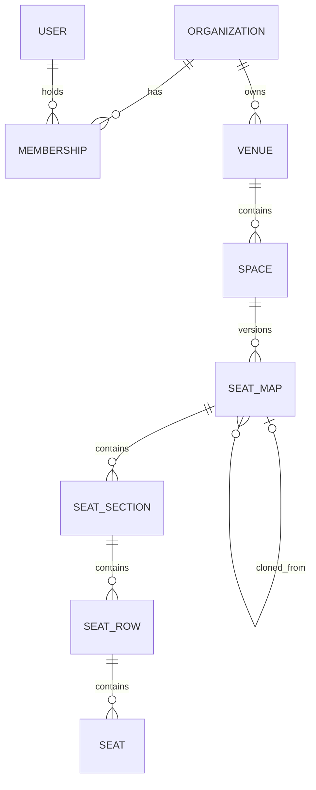

# SeatFlow architecture

## Architectural style

SeatFlow is a modular monolith in Next.js 16 App Router. One deployable application keeps operations understandable while explicit server and feature boundaries prevent route components from becoming authorization or persistence layers.

Phase 2 adds tenant-owned venues, spaces, and versioned seat maps without changing the static Phase 0 event catalogue into fake persisted events.

## Current module boundaries

- `src/app` owns route composition, metadata, the Better Auth handler, and narrowly scoped server actions.
- `src/components` owns reusable UI and the smallest required client boundaries.
- `src/env` validates application, migration, and test-database configuration without exposing values in errors.
- `src/features` owns Zod input contracts and deterministic normalization.
- `src/lib` owns lazy database/auth clients, request-scoped session lookup, and Next.js authorization interrupts.
- `src/server` owns framework-light application services that integration tests can call directly.
- `prisma` is the source of truth for identity, tenancy, venue, space, and seat-map persistence.
- `tests/integration` validates real persistence against a dedicated PostgreSQL database.

Database and Better Auth clients are initialized lazily. This avoids opening pools during module evaluation and keeps schema generation/build tooling independent from a live connection. The runtime creates one Prisma client per process.

## Identity and tenant model

`User`, `Account`, `Session`, and `Verification` follow Better Auth's core schema. `User.platformRole` has only `USER` and `ADMIN`, defaults to `USER` in PostgreSQL, and is configured as `input: false` in Better Auth. The browser never selects a role.

Organizations have a unique normalized slug and one kind: `ORGANIZER` or `VENUE_OPERATOR`. A membership connects one user to one organization with `OWNER`, `ADMIN`, or `MEMBER`. The `(userId, organizationId)` pair is unique, and capability is always derived from that scoped record.

## Phase 2 entity relationships

Venue slugs are unique inside an organization; space slugs are unique inside a venue. Seat-map versions are unique inside a space. Section codes, row labels, and seat labels are unique at their natural parent scope. Layout children cascade only with their seat-map snapshot; organization-to-venue, venue-to-space, and space-to-map relations use restrictive deletion so historical structures cannot disappear accidentally.

PostgreSQL also verifies that every venue's organization is a `VENUE_OPERATOR`, that clone sources belong to the same space, and that published or archived seat-map snapshots cannot be deleted. These checks complement rather than replace application authorization.

Account and session rows cascade when a user is deleted. Memberships cascade when either their user or organization is deleted. Deleting a user does not delete an organization: tenants can outlive one member and require deliberate lifecycle handling in a later administration phase.

## Authorization boundary

Navigation is server-session-aware for truthful rendering, but navigation is not security. Every protected page revalidates the session at the data boundary. Onboarding server actions accept only a name, fix the organization kind in server code, and fix the current user's membership to `OWNER`.

Central utilities provide:

- request-scoped session lookup and `requireAuth`
- platform `ADMIN` enforcement using a fresh database read
- organization lookup scoped by current user, organization identity, kind, and minimum membership role
- nested venue, space, map, section, row, and seat lookups that verify every ancestor supplied by the route or form
- explicit JSON 401/403 responses for future route handlers
- safe internal redirect normalization

Next.js `forbidden()` produces the shared 403 experience. Route proxying is not used as an authorization source.

## Organizer creation consistency

Name whitespace is normalized and a lowercase URL slug is derived on the server. A preflight check provides a useful duplicate response; the database unique constraint remains authoritative for races. Prisma's nested relational create writes the organization and OWNER membership in one database transaction, so both records persist or neither does.

## Rendering strategy

Public event data remains the validated Phase 0 fixture set. Personalized headers and dashboards are request-bound Server Components. Authentication forms and pending server-action forms are client islands; authorization and persistence remain server-side.

The seat-map editor is server-rendered data with narrow client islands for bulk-label preview and keyboard-accessible seat selection. The interactive editor and read-only preview share one bounded, scrollable coordinate canvas, so persisted `x` and `y` values have the same visual meaning in both views while DOM order remains semantic. Mutations use Server Actions, but every action performs fresh authentication and service-layer tenant authorization. Published previews reuse the same layout representation without exposing booking behavior.

## Seat-map transaction strategy

Draft creation and cloning allocate the next version inside a serializable transaction with bounded retry. Bulk generation performs its cap checks and nested row/seat write in one serializable transaction. Publishing validates the complete graph, archives any current published version, and publishes the draft in one serializable transaction. A PostgreSQL partial unique index independently permits only one `PUBLISHED` row per space.

Published and archived maps are immutable in both the service layer and PostgreSQL triggers. The only permitted transition from a published map is `PUBLISHED` to `ARCHIVED` during replacement. Layout-child triggers validate both the old and new ancestry during a re-parenting update, preventing a direct database write from moving content into or out of an immutable graph. Deep clones receive new identifiers and a `sourceSeatMapId`; editing the clone cannot mutate the source. Archiving a venue or space leaves nested statuses and history intact but makes every descendant draft effectively read-only until its parent hierarchy is restored.

## Testing strategy

- Unit tests cover pure configuration, normalization, venue/space input contracts, generation limits, capacity, lifecycle decisions, redirects, roles, and database-guard behavior.
- Component tests cover accessible Phase 0 event rendering, seat-map states and empty layouts, bulk-generation preview behavior, seat editing, and venue form contracts.
- PostgreSQL integration tests cover identity plus wrong-kind access, OWNER/ADMIN/MEMBER permissions, guessed nested IDs, cross-tenant chains, scoped slugs, archive/restore, parent archive enforcement, atomic bulk generation, hard limits, version allocation, parent immutability, publication rollback, database snapshot immutability, deep cloning, and one-current-published enforcement.
- CI provisions native PostgreSQL, migrates the development target, resets/migrates a separate test target, and runs lint, types, both test suites, and the production build.

Future end-to-end tests will cover the browser flows once the repository has a stable test-server fixture.
