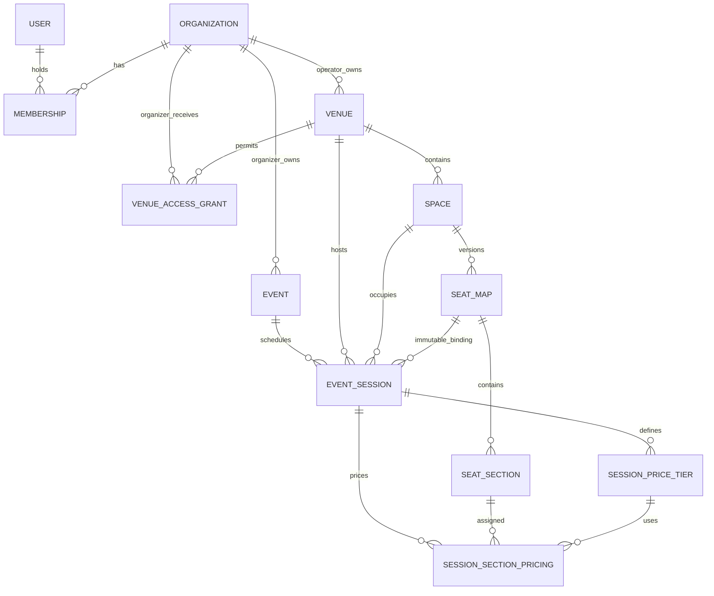

# SeatFlow architecture

## Architectural style

SeatFlow is a modular monolith on Next.js 16 App Router. `src/app` composes routes and Server Actions, `src/components` owns UI, `src/features` owns Zod and deterministic domain rules, `src/lib` owns request-aware infrastructure, and `src/server` owns framework-light services. Prisma/PostgreSQL is authoritative for identity, tenancy, venue layouts, events, sessions, access, and pricing.

Database and Better Auth clients initialize lazily, so code generation and production builds do not require a live connection. Protected pages and every action perform fresh server-side authorization.

## Phase 3 relationships

Events belong to organizer organizations. Venues belong to venue-operator organizations. `VenueAccessGrant` is the deliberate relationship between those tenancy boundaries and records both parties, the venue, status, timestamps, and grant/revoke actors. Active duplicates are prevented by a PostgreSQL partial unique index; grant history is append-only.

Event slugs are unique inside their organizer. A stable globally unique public slug combines organizer and event slugs. Sessions store the complete venue/space/map ancestry and the exact published map ID. Database triggers independently verify every ancestry and organization-kind invariant.

## Authorization and validation

Membership capability is always resolved from the current user plus organization identity and kind. Organizer OWNER/ADMIN users manage events; organizer MEMBER is read-only. Venue-operator OWNER/ADMIN users grant or revoke access; operator MEMBER is read-only. Nested event/session/tier/section lookups verify all supplied ancestors, so guessed IDs do not grant capability.

Server Actions parse external input with centralized Zod schemas, then delegate to services. Services re-authorize and transact. PostgreSQL constraints and triggers remain the final line for races or direct writes. Navigation visibility and disabled controls are never treated as authorization.

## Session time and conflict strategy

Browser forms accept venue-local date/time values. A deterministic IANA-time-zone helper converts them to UTC and rejects impossible local times. The database stores UTC-capable PostgreSQL timestamps; rendering always uses the venue's zone.

Session creation and publication check overlaps in application code for useful errors. PostgreSQL's `btree_gist` exclusion constraint enforces non-overlap for every non-cancelled session in one space using `[startAt, endAt)`. A session ending exactly when another starts is therefore legal. Cancelled sessions do not block the range.

## Publication and immutability

Event and session publication are separate. Session publication uses a serializable transaction to reload ancestry, access, times, conflicts, seat-map capacity, tiers, and assignments before changing state. Draft publication becomes `ON_SALE` when the sales window is currently open, otherwise `SCHEDULED`; repeated publication returns the unchanged published session.

Published session venue, space, seat-map, dates, pricing, and assignments are immutable in services and PostgreSQL. A newly published seat-map version never retargets an existing session. Restrictive foreign keys keep referenced maps and event/session history. Revoking access blocks new scheduling and draft publication but does not rewrite already published sessions.

## Pricing model

`SessionPriceTier.priceMinor` is an integer and currency is a centralized enum (`AZN`, `EUR`, `GBP`, `USD`). Codes are unique per session and display order is explicit. A batch pricing transaction validates that each tier and section belongs to the same draft session and that every section belongs to the bound map. One `(session, section)` assignment is allowed. Publication requires one currency and complete coverage for every section with active seats; blocked seats are excluded.

## Public query strategy

Public services query only published events with future eligible sessions. They calculate persisted-domain view models containing earliest session, venue/city, minimum configured price, currency, capacity, and read-only map data. Invalid, incomplete, cancelled, archived, and unpublished records are filtered out; there is no fixture fallback.

## Testing strategy

- Unit tests cover event/session validation, slugging, money, local time, conflicts, coverage, public visibility, and lifecycle rules.
- Component tests cover event/session forms, tier/coverage summaries, public cards, and empty states.
- PostgreSQL tests cover identity and Phase 2 regressions plus event ownership, access grants, ancestry, overlap exclusion, pricing isolation, publication, immutability, cancellation, visibility, and restrictive references.
- The integration runner accepts only a distinct `TEST_DATABASE_URL`, resets it, and applies Phase 1, 2, and 3 migrations in order.
