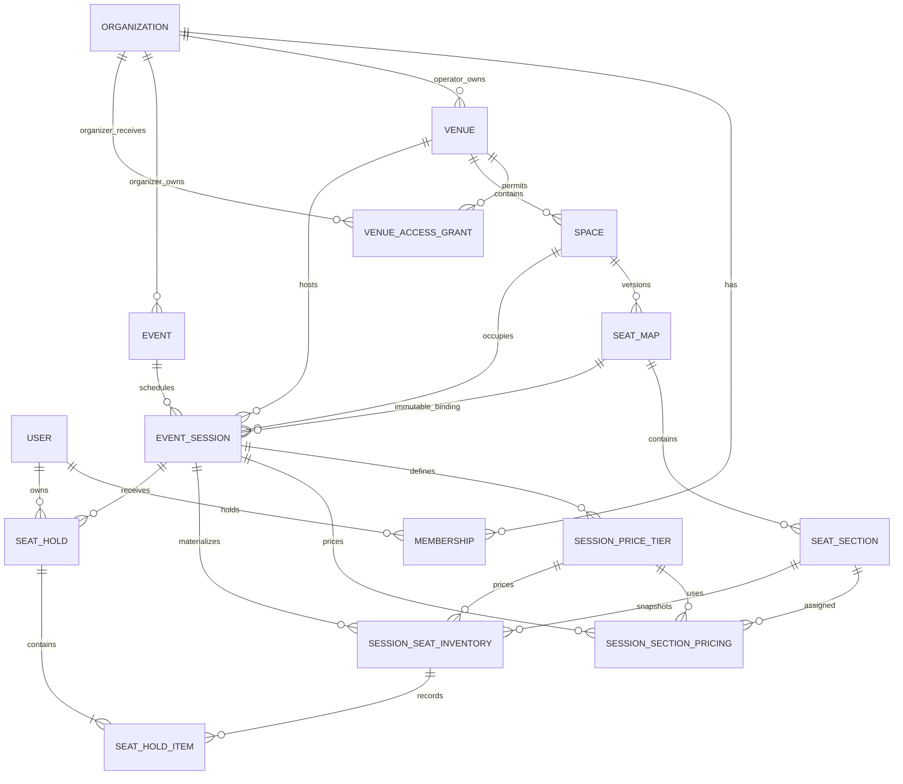

# SeatFlow architecture

## Architectural style

SeatFlow is a modular monolith on Next.js 16 App Router. `src/app` composes routes and Server Actions, `src/components` owns UI, `src/features` owns Zod and deterministic domain rules, `src/lib` owns request-aware infrastructure, and `src/server` owns framework-light services. Prisma/PostgreSQL is authoritative for identity, tenancy, venue layouts, events, sessions, pricing, per-session inventory, and active holds.

Database and Better Auth clients initialize lazily, so code generation and production builds do not require a live connection. Protected pages and every action perform fresh server-side authorization.

## Phase 3 and Phase 4A relationships

Events belong to organizer organizations. Venues belong to venue-operator organizations. `VenueAccessGrant` is the deliberate relationship between those tenancy boundaries and records both parties, the venue, status, timestamps, and grant/revoke actors. Active duplicates are prevented by a PostgreSQL partial unique index; grant history is append-only.

Event slugs are unique inside their organizer. A stable globally unique public slug combines organizer and event slugs. Sessions store the complete venue/space/map ancestry and the exact published map ID. Database triggers independently verify every ancestry and organization-kind invariant.

## Authorization and validation

Membership capability is always resolved from the current user plus organization identity and kind. Organizer OWNER/ADMIN users manage events; organizer MEMBER is read-only. Venue-operator OWNER/ADMIN users grant or revoke access; operator MEMBER is read-only. Nested event/session/tier/section lookups verify all supplied ancestors, so guessed IDs do not grant capability.

Server Actions parse external input with centralized Zod schemas, then delegate to services. Services re-authorize and transact. PostgreSQL constraints and triggers remain the final line for races or direct writes. Navigation visibility and disabled controls are never treated as authorization.

## Session time and conflict strategy

Browser forms accept venue-local date/time values. A deterministic IANA-time-zone helper converts them to UTC and rejects impossible local times. The database stores UTC-capable PostgreSQL timestamps; rendering always uses the venue's zone.

Session creation and publication check overlaps in application code for useful errors. PostgreSQL's `btree_gist` exclusion constraint enforces non-overlap for every non-cancelled session in one space using `[startAt, endAt)`. A session ending exactly when another starts is therefore legal. Cancelled sessions do not block the range.

## Publication and immutability

Event and session publication are separate. Session publication uses a serializable transaction to reload ancestry, access, times, conflicts, seat-map capacity, tiers, and assignments before changing state. Draft publication becomes `ON_SALE` when the sales window is currently open, otherwise `SCHEDULED`; repeated publication returns the unchanged published session.

Published session venue, space, seat-map, dates, pricing, and assignments are immutable in services and PostgreSQL. Before publication commits, the same transaction materializes inventory and verifies that its row count equals sellable capacity. A newly published seat-map version never retargets an existing session. Restrictive foreign keys keep referenced maps and event/session/hold history. Revoking access blocks new scheduling and draft publication but does not rewrite already published sessions.

## Pricing model

`SessionPriceTier.priceMinor` is an integer and currency is a centralized enum (`AZN`, `EUR`, `GBP`, `USD`). Codes are unique per session and display order is explicit. A batch pricing transaction validates that each tier and section belongs to the same draft session and that every section belongs to the bound map. One `(session, section)` assignment is allowed. Publication requires one currency and complete coverage for every section with active seats; blocked seats are excluded.

## Authoritative inventory and immutable snapshots

`SessionSeatInventory` contains one row for each active physical seat in a priced section of one published session. Materialization derives only from the session's exact immutable map plus `SessionSectionPricing`; blocked or unpriced seats produce no row. `(sessionId, seatId)` is unique. Price tier, price minor units, currency, seat, section, session, and creation identity are immutable after insertion.

`SeatHold` stores owner, session, unguessable public token, idempotency key, server expiry, and lifecycle. `SeatHoldItem` stores immutable historical membership and copies the inventory price snapshot. PostgreSQL checks and triggers enforce state/hold linkage, same-session ancestry, faithful prices, legal lifecycle timestamps, permanent inventory/hold history, and terminal-state immutability. A partial unique index allows at most one active hold per customer per session.

## Atomic acquisition and expiry

Hold acquisition accepts only session ID, physical-seat IDs, and an idempotency key. The service derives the authenticated user and reads price, currency, status, sales windows, and expiry from trusted server/database state. Inside one transaction it lazily expires overdue holds, locks the requested inventory rows in deterministic seat order with `SELECT … FOR UPDATE`, rechecks sales eligibility, creates the hold, conditionally changes every row from `AVAILABLE` to `HELD`, and writes all hold items. Any missing, cross-session, blocked, or contended seat aborts the transaction, so no partial selection remains.

Transactions use bounded retry for PostgreSQL deadlock/serialization failures only. Row locks and guarded updates provide the normal contention control; retries never mask validation or availability conflicts. Identical retries return the existing hold when the customer/session/key and exact order-independent seat set match. Reusing the key with a different seat set is rejected.

The default TTL is ten minutes and the default maximum is eight seats. Both are bounded server configuration. Manual owner release and session cancellation release inventory transactionally. Request-time lazy reclamation prevents expired rows from remaining trapped if the sweeper is unavailable. The operations sweeper claims bounded batches with `FOR UPDATE SKIP LOCKED`, so concurrent sweepers partition work safely. Phase 4A does not schedule the command automatically.

## Public query strategy

Public services query only published events with future eligible sessions. They calculate persisted-domain view models containing earliest session, venue/city, minimum configured price, currency, capacity, and read-only map data. The seat-selection query maps inventory to `AVAILABLE`, `HELD_BY_YOU`, `UNAVAILABLE`, or `BLOCKED`; another customer's hold linkage is never serialized. Invalid, incomplete, cancelled, archived, and unpublished records are filtered out; there is no fixture fallback.

There is no Redis cache or real-time delivery in Phase 4A. PostgreSQL remains the only source of truth, Server Components read at request time, and hold creation performs the decisive availability check. A browser refresh is the synchronization mechanism until Phase 4B.

## Testing strategy

- Unit tests cover event/session rules plus sales-window boundaries, hold lifecycle, totals, selection validation, idempotency matching, materialization, safe view models, and availability mapping.
- Component tests cover organizer/customer forms and summaries, coordinate selection states, prices, maximum feedback, pending/conflict behavior, fake-time countdowns, and empty states.
- PostgreSQL tests cover the Phase 0–3 baseline plus materialization, immutable snapshots, ownership, all-or-nothing acquisition, concurrency, idempotency, release, expiry, cancellation, and direct invariant violations.
- The integration runner accepts only a distinct `TEST_DATABASE_URL`, resets it, and applies the complete append-only migration chain through Phase 4A.
