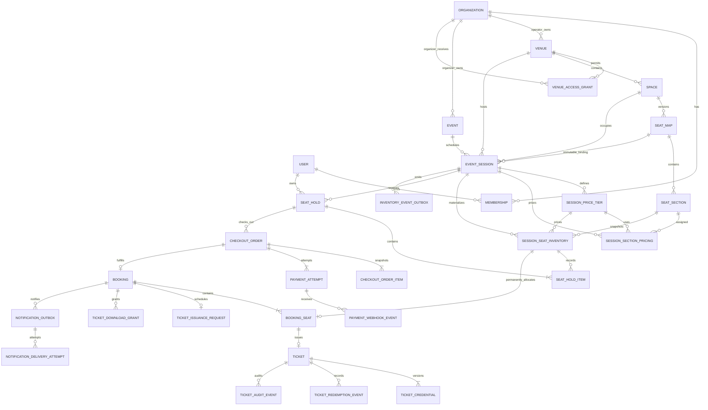

# SeatFlow architecture

## Architectural style

SeatFlow is a modular monolith on Next.js 16 App Router with separate Node worker and realtime processes. `src/app` composes routes and Server Actions, `src/components` owns UI, `src/features` owns Zod and deterministic domain rules, `src/lib` owns request-aware infrastructure, and `src/server` owns framework-light services. Prisma/PostgreSQL is authoritative for identity, tenancy, venue layouts, events, sessions, pricing, per-session inventory, holds, checkout, payment observations, bookings, tickets, redemption history, and transactional delivery hand-offs.

Database and Better Auth clients initialize lazily, so code generation and production builds do not require a live connection. Protected pages and every action perform fresh server-side authorization.

## Phase 3 and Phase 4A relationships



Events belong to organizer organizations. Venues belong to venue-operator organizations. `VenueAccessGrant` is the deliberate relationship between those tenancy boundaries and records both parties, the venue, status, timestamps, and grant/revoke actors. Active duplicates are prevented by a PostgreSQL partial unique index; grant history is append-only.

Event slugs are unique inside their organizer. A stable globally unique public slug combines organizer and event slugs. Sessions store the complete venue/space/map ancestry and the exact published map ID. Database triggers independently verify every ancestry and organization-kind invariant.

## Authorization and validation

Membership capability is always resolved from the current user plus organization identity and kind. Organizer OWNER/ADMIN users manage events; organizer MEMBER is read-only. Venue-operator OWNER/ADMIN users grant or revoke access; operator MEMBER is read-only. Nested event/session/tier/section lookups verify all supplied ancestors, so guessed IDs do not grant capability.

Server Actions parse external input with centralized Zod schemas, then delegate to services. Services re-authorize and transact. PostgreSQL constraints and triggers remain the final line for races or direct writes. Navigation visibility and disabled controls are never treated as authorization.

## Session time and conflict strategy

Browser forms accept venue-local date/time values. A deterministic IANA-time-zone helper converts them to UTC and rejects impossible local times. The database stores UTC-capable PostgreSQL timestamps; rendering always uses the venue's zone.

Session creation and publication check overlaps in application code for useful errors. PostgreSQL's `btree_gist` exclusion constraint enforces non-overlap for every non-cancelled session in one space using `[startAt, endAt)`. A session ending exactly when another starts is therefore legal. Cancelled sessions do not block the range.

## Publication and immutability

Event and session publication are separate. Session publication uses a serializable transaction to reload ancestry, access, times, conflicts, seat-map capacity, tiers, and assignments before changing state. Draft publication becomes `ON_SALE` when the sales window is currently open, otherwise `SCHEDULED`; repeated publication returns the unchanged published session.

Published session venue, space, seat-map, dates, pricing, and assignments are immutable in services and PostgreSQL. Before publication commits, the same transaction materializes inventory and verifies that its row count equals sellable capacity. A newly published seat-map version never retargets an existing session. Restrictive foreign keys keep referenced maps and event/session/hold history. Revoking access blocks new scheduling and draft publication but does not rewrite already published sessions.

## Pricing model

`SessionPriceTier.priceMinor` is an integer and currency is a centralized enum (`AZN`, `EUR`, `GBP`, `USD`). Codes are unique per session and display order is explicit. A batch pricing transaction validates that each tier and section belongs to the same draft session and that every section belongs to the bound map. One `(session, section)` assignment is allowed. Publication requires one currency and complete coverage for every section with active seats; blocked seats are excluded.

## Authoritative inventory and immutable snapshots

`SessionSeatInventory` contains one row for each active physical seat in a priced section of one published session. Materialization derives only from the session's exact immutable map plus `SessionSectionPricing`; blocked or unpriced seats produce no row. `(sessionId, seatId)` is unique. Price tier, price minor units, currency, seat, section, session, and creation identity are immutable after insertion.

`SeatHold` stores owner, session, unguessable public token, idempotency key, server expiry, and lifecycle. `SeatHoldItem` stores immutable historical membership and copies the inventory price snapshot. PostgreSQL checks and triggers enforce state/hold linkage, same-session ancestry, faithful prices, legal lifecycle timestamps, permanent inventory/hold history, and terminal-state immutability. A partial unique index allows at most one active hold per customer per session.

`CheckoutOrder` and `CheckoutOrderItem` form another immutable financial snapshot owned by the same authenticated customer. The order copies session, hold, currency, subtotal, total, expiry, and a public reference; items copy physical seat, inventory, tier, unit price, and currency. Database triggers verify exact ancestry and totals. Client price, currency, total, user, order status, and payment status are not part of the input contract.

## Atomic acquisition and expiry

Hold acquisition accepts only session ID, physical-seat IDs, and an idempotency key. The service derives the authenticated user and reads price, currency, status, sales windows, and expiry from trusted server/database state. Inside one transaction it lazily expires overdue holds, locks the requested inventory rows in deterministic seat order with `SELECT … FOR UPDATE`, rechecks sales eligibility, creates the hold, conditionally changes every row from `AVAILABLE` to `HELD`, and writes all hold items. Any missing, cross-session, blocked, or contended seat aborts the transaction, so no partial selection remains.

Transactions use bounded retry for PostgreSQL deadlock/serialization failures only. Row locks and guarded updates provide the normal contention control; retries never mask validation or availability conflicts. Identical retries return the existing hold when the customer/session/key and exact order-independent seat set match. Reusing the key with a different seat set is rejected.

The default TTL is ten minutes and the default maximum is eight seats. Both are bounded server configuration. Manual owner release and session cancellation release inventory transactionally. Request-time lazy reclamation prevents expired rows from remaining trapped if the sweeper is unavailable. The operations sweeper claims bounded batches with `FOR UPDATE SKIP LOCKED`, so concurrent sweepers partition work safely. Phase 4A does not schedule the command automatically.

## Phase 4B transactional delivery

Every authoritative mutation inserts an `InventoryEventOutbox` row before its PostgreSQL transaction commits. The payload is a strict public invalidation DTO: unique event ID, session ID, event type, and trusted server timestamp. Customer identity, internal ownership, hold tokens, authentication data, and organization data are absent. Unique lifecycle deduplication keys and database lifecycle/size checks protect direct writes.

Dispatchers claim bounded due batches with `FOR UPDATE SKIP LOCKED`. Redis publication uses one Lua operation to set an expiring event-dedup key and append to a bounded Redis Stream atomically. PostgreSQL is marked processed only after delivery succeeds. Redacted failures schedule exponential backoff; the configured final attempt dead-letters the row. A Redis error occurs after the inventory commit boundary and therefore cannot invalidate or roll back a hold.

BullMQ registers one repeatable job, but the job only invokes the existing PostgreSQL sweeper. Redis TTLs never release inventory. Concurrent BullMQ workers remain safe because the database sweeper owns claiming and lifecycle guards.

## Realtime invalidation and refresh

Socket.IO is a standalone gateway consuming the Redis Stream. Web and organizer pages receive short-lived HMAC room tickets only after their public-visibility or tenant-authorization checks pass. Each socket joins one server-derived session room. Connection and subscription limits, exact origin checks, strict event parsing, and fixed key namespaces prevent arbitrary subscription/key injection.

Messages are invalidations, not inventory deltas. A client validates session/event identity, tolerates duplicates and stale order, then fetches a no-store PostgreSQL snapshot. Local selected seats are reconciled against that snapshot. Reconnect, Redis recovery, window focus, and low-frequency disconnected polling all trigger the same authoritative refresh path. The gateway never computes availability.

## Phase 5A payment and booking boundary

Checkout first commits an order and `PaymentAttempt` with a stable provider idempotency key. Only then does the service call the provider, outside a database transaction. A timeout leaves a retryable `CREATED` attempt; the same key produces the same intent on recovery. A provider create/retrieve response can update bounded diagnostic state but can never mark the order paid.

The provider webhook route reads a bounded raw byte body and verifies its signature before parsing or storing normalized fields. The local development/test provider signs `timestamp.rawBody` with HMAC-SHA256 and compares fixed-size digests in constant time. Its deterministic intent and signed success/failure deliveries support automated and browser verification, but configuration rejects it in production. The `EXTERNAL` registry entry is an explicit deployment gate until a reviewed adapter and credentials exist.

Webhook processing persists a unique `(provider, providerEventId)` observation and then locks the webhook, attempt, order, hold, and sorted inventory rows. It checks intent identity, amount, currency, first terminal state, ownership, session ancestry, live hold eligibility, and exact ordered inventory. A verified success atomically:

1. marks the attempt succeeded and order paid;
2. inserts one booking and exactly one booking seat per order item;
3. changes those inventory rows from `HELD` to permanent `BOOKED`;
4. changes the hold from `ACTIVE` to `CONVERTED`;
5. marks the order `FULFILLED` and writes safe outbox invalidations.

Unique constraints and deferred database checks make duplicate or concurrent distinct success events exact once. If payment is verified but fulfillment is unsafe, the order enters paid-unfulfilled/review state with a bounded safe code. Operators can reprocess the stored verified event; no command, redirect, or reconciliation response can fabricate success.

Booked inventory has no transition back to available in Phase 5A. Session cancellation preserves confirmed bookings for future post-payment handling rather than silently refunding or releasing them.

## Phase 5A operations and Redis independence

Bounded commands initialize/retrieve pending provider intents, reprocess an internally stored verified webhook, expire unpaid checkouts, and report stale or paid-unfulfilled records. The admin health route exposes counts only. All booking writes and outbox inserts commit in PostgreSQL before Redis delivery. If Redis is unavailable, booking correctness is unchanged and outbox rows remain pending for the existing retrying dispatcher.

## Phase 5B issuance and credential boundary

Verified fulfillment creates a unique `TicketIssuanceRequest` in the booking transaction. Issuance runs after commit and can also be drained by a bounded worker. It locks one due request, verifies the confirmed booking and exact booked-seat ancestry, then upserts one `Ticket` per `BookingSeat`, creates credential version 1, and enqueues one booking-ready notification. Request status, attempt count, safe error code, exponential backoff, and dead-letter state make failure visible without rolling back payment or booking.

A ticket public reference is 192 bits of CSPRNG entropy. The QR credential is a versioned opaque HMAC-SHA256 derivation from the dedicated ticket secret, public reference, and credential version. Only a second keyed HMAC hash is stored. One partial unique index allows one active credential per ticket; another allows at most one accepted redemption. Credential history links a replaced version to its newer successor. Database triggers freeze ticket ancestry and terminal ticket, credential, redemption, grant, and audit history.

Credential rotation creates the successor before connecting the prior version inside one transaction; a deferred constraint verifies that every `REPLACED` credential ultimately points to a newer version of the same ticket. Revocation changes both active credential and ticket terminally and writes a bounded audit reason. Management requires platform ADMIN or organizer OWNER/ADMIN and never returns or logs plaintext.

## Entry validation

The validation route accepts a bounded credential, target session, and idempotency key from an authenticated scanner. Authorization for the target session occurs before credential lookup: organizer OWNER/ADMIN is allowed, as is venue-operator OWNER/ADMIN for the session's venue. A per-process request limiter is defense in depth; authorization and database uniqueness remain decisive.

Inside one transaction the service reads database time as Unix epoch milliseconds, locks the credential then ticket, verifies its keyed hash, session binding, session lifecycle, configurable entry window, and terminal state, then appends a redemption outcome. The first valid scan changes ticket and credential to `USED`; concurrent scans converge to one `ACCEPTED` and one `ALREADY_USED`. Unknown credential attempts store no credential hash or plaintext. Offline acceptance is deliberately unsupported.

## Protected QR and PDF delivery

Customer ticket queries always bind public reference to the authenticated owner. The QR endpoint re-derives and integrity-checks only the current active credential, returns a no-store SVG with a restrictive content-security policy, and never exposes an internal database ID. Used, revoked, and replaced credentials are not rendered as reusable QR codes.

A PDF action creates a 256-bit random download token but stores only its keyed hash. The grant is bound to user and booking, short-lived, and single-use. Consumption first resolves ownership, locks the grant, rechecks database time and confirmed-booking ancestry, renders the bytes, and only then commits `usedAt`; concurrent/replayed downloads return not found. `pdf-lib` and `qrcode` render one bounded ticket per page with embedded assets only, so untrusted URLs cannot trigger server-side fetches.

## Notification delivery

Ticket-ready, credential-rotated, and revoked events enter `NotificationOutbox` through the same PostgreSQL transaction as their domain mutation. Concurrent dispatchers partition due rows with `SKIP LOCKED`. A just-in-time PDF grant is included in a context-only email; credentials and QR payloads never enter the outbox or message body. The grant token and provider idempotency key are stable for one attempt (including a crash retry) and change only after a committed failed attempt. Every result records an append-only attempt. Success terminates delivery, transient failure schedules bounded exponential backoff, and permanent/final failure dead-letters without affecting ticket validity.

`LOCAL_FILE` writes deterministic development/test captures with strict header and recipient validation and is forbidden in production. `EXTERNAL` is an explicit deployment gate until a reviewed provider adapter is installed. Notification operations are independent of Redis.

## Public query strategy

Public services query only published events with future eligible sessions. They calculate persisted-domain view models containing earliest session, venue/city, minimum configured price, currency, capacity, and read-only map data. The seat-selection query maps inventory to `AVAILABLE`, `HELD_BY_YOU`, `UNAVAILABLE`, or `BLOCKED`; another customer's hold linkage is never serialized. Invalid, incomplete, cancelled, archived, and unpublished records are filtered out; there is no fixture fallback.

Phase 4B adds Redis transport and real-time invalidation without adding a Redis availability cache. PostgreSQL remains the only source of truth, no-store snapshot handlers read it at request time, and hold creation performs the decisive availability check.

## Testing strategy

- Unit tests cover event/session rules plus sales-window boundaries, hold/checkout/payment lifecycle, integer totals, selection validation, idempotency matching, materialization, safe view models, and availability mapping.
- Component tests cover organizer/customer forms and summaries, coordinate selection states, prices, maximum feedback, pending/conflict behavior, fake-time countdowns, and empty states.
- PostgreSQL tests cover the Phase 0–3 baseline plus materialization, immutable snapshots, ownership, all-or-nothing acquisition, concurrency, idempotency, release, expiry, cancellation, and direct invariant violations.
- Phase 4B PostgreSQL tests cover atomic outbox commit/rollback, every mutation integration, concurrent dispatch claiming, retry/backoff, and dead-letter lifecycle.
- A separate mandatory real-Redis suite covers Streams publication/deduplication, cursor reconnect, signed room isolation, outage/recovery, and multi-worker BullMQ expiry.
- Phase 5A PostgreSQL tests cover ownership, immutable order snapshots, concurrent checkout idempotency, raw webhook verification, amount/currency mismatch, failure, duplicate/concurrent exact-once fulfillment, permanent booked inventory, rollback/reprocess, provider timeout recovery, and paid-unfulfilled outcomes.
- A provider-contract suite covers deterministic create/retrieve/cancel, signed success/failure, delayed/duplicate delivery, tamper rejection, and production gating. The real-Redis suite also proves payment fulfillment commits once during dispatch outage and drains after recovery.
- Phase 5B PostgreSQL tests cover exact issuance, issuance failure/retry, ancestry invariants, rotation/revocation, first-use and concurrent scans, cross-tenant/session denial, append-only history, grant ownership/expiry/replay, delivery retry/dead letter, and concurrent dispatcher deduplication.
- Dedicated notification-provider and PDF parsing suites verify deterministic idempotency, timeout/failure classification, production gating, page count, extracted text, QR images, and input bounds.
- The integration runners accept only a distinct `TEST_DATABASE_URL`, reset it, and apply the complete append-only migration chain through Phase 5B.

## Phase 5C1 production readiness

Observability is a deliberate layer, not scattered `console` calls. `src/features/observability` holds pure redaction, correlation, and error-classification rules; `src/server/observability` holds the logger and the in-process metric registry. Keeping the rules pure is what makes redaction exhaustively unit testable without a transport.

Logging uses allow-list discipline. A caller may attach only bounded primitives under a non-sensitive key, and every free-text value is scrubbed for connection strings, ticket credentials, webhook signatures, bearer tokens, JWTs, stored hashes, long bearer-shaped tokens, and email addresses. Objects and arrays are dropped rather than serialized, which is what stops a Prisma error, request, or provider response from being flattened into a record wholesale. Errors are reduced to a classification, a bounded code, and a scrubbed message; for Prisma only the code is used, because Prisma messages embed query text.

A correlation identifier is established by `src/proxy.ts` (this Next.js version's replacement for the deprecated `middleware` convention) and echoed on the response. An inbound value is honoured only when it matches a strict URL-safe grammar, which is what makes it safe to reflect into a header. It is never an authentication factor and never an idempotency key. This is correlation, not distributed tracing: there is no span model and no trace propagation standard.

Health separates three questions. Liveness reports whether the process runs and performs no dependency I/O, so a database blip cannot cause an orchestrator to restart every healthy instance. Readiness performs bounded probes and distinguishes `warn` from `fail`: a backlog warns, because draining it needs the instance working, while an unreachable database or a schema behind the code fails. Redis is required for worker roles and deliberately not for `web`, preserving the Phase 4B property that PostgreSQL alone is sufficient for correct holds, payments, and entry.

`WorkerHeartbeat` gives durable worker visibility keyed by `(workerType, environment, instanceLabel)`. It lives in PostgreSQL rather than Redis because a Redis-based heartbeat would vanish at exactly the moment a Redis-dependent worker stopped. Staleness is derived from `lastSeenAt` rather than self-reporting, since a crashed worker cannot report anything; a deliberate shutdown writes `STOPPED` so maintenance stays distinguishable from a crash. The table has no column for a hostname, address, connection string, or command line, and database checks bound the label grammar.

Abuse control becomes distributed. One atomic Lua `INCR`-plus-expire shares a fixed window across every web instance, keyed by an HMAC of the subject so no raw address, email, or token enters the Redis key space. Each policy declares its failure mode. Most are fail-open because PostgreSQL remains decisive: a webhook must never be dropped for a cache outage, checkout is already exact-once, and a skipped rate-limit check cannot forge an entry acceptance, which still requires a matching credential hash and a free single-use index. Mutating administrative operations fail closed.

Client addresses are resolved under an explicit trusted-proxy policy rather than by reading `X-Forwarded-For`. Phase 4B's helper trusted that header unconditionally, which let any caller reset its own limiter bucket by rotating a value it fully controls; forwarding headers are now honoured only when the deployment declares who may set them, and a malformed chain is rejected outright rather than partially trusted. Addresses reaching logs are coarsened to a /24 or /48.

Security headers are generated by a pure function and applied in the proxy: a per-request nonce with `strict-dynamic` for scripts, denied framing and plugins, a referrer policy, and a permissions policy that grants only the camera the scanner needs. `style-src` retains `'unsafe-inline'` because the seat map positions every seat with an inline style attribute, which a nonce cannot cover.

## Phase 5C2A: refunds, disputes, and the financial ledger

### The provider boundary

`src/server/payments/payment-provider.ts` defines provider-neutral types. No Stripe object, Resend object, or raw provider payload crosses it, so a provider change cannot reach a domain service and a provider field is never trusted merely for arriving in a familiar shape. Capabilities are *reported* rather than assumed. An event type this build does not model normalizes to `UNSUPPORTED` instead of being guessed at.

Adapters are constructed only when explicitly selected *and* fully configured, so a leftover credential cannot switch a deployment onto a live payment network.

### Refund submission holds no database lock

The ordering in `submission-service.ts` is the design:

1. The refund already exists with a deterministic provider idempotency key, committed before anything leaves the process.
2. Claim it (`REQUESTED` → `SUBMITTING`) in a short transaction; the claim stops two workers submitting the same refund.
3. Call the provider **with no row lock held**. An external HTTP call inside a transaction would pin a lock for the duration of someone else's network.
4. Record the outcome in a second short transaction.

Because the key is committed before step 3, a timeout, a crash between 3 and 4, and a retry after restart all converge: the provider returns the refund it already created. A provider timeout deliberately leaves the refund `PROCESSING`, never failed — failing it would let a retry create a second external refund.

### Exact-once settlement

Payment, refund, and dispute webhooks share one `PaymentWebhookEvent` table. That is deliberate: one unique `(provider, providerEventId)` gives exact-once replay protection across every financial event type, so a refund event and a payment event can never collide. Settlement runs inside one transaction that marks the webhook processed only at the end, so any failure leaves it retryable rather than recorded as done.

### Append-only ledger

`FinancialLedgerEntry` is append-only, enforced by a trigger that rejects every UPDATE and DELETE. Direction is fixed per entry type by both code and a CHECK constraint, so a refund can never be booked as a credit that cancels the original capture. Only *settling* entry types count towards a balance, so a pending refund request never looks like money that already moved.

### Dispute lifecycle

A dispute exists only because a verified webhook created it. The first terminal outcome is permanent; a contradictory terminal event escalates to `REQUIRES_REVIEW` with the original outcome intact and records no chargeback. `PaymentDisputeEvent` is append-only normalized history, unique per `(disputeId, providerEventId)`.

### Ticket and inventory consequences

A partial refund revokes only the refunded seats' tickets and leaves the booking `CONFIRMED`. A full refund moves the booking to terminal `REFUNDED` and revokes all active tickets. A ticket already `USED` stays used with its redemption history. Nothing is deleted. **Inventory never returns to `AVAILABLE`** — the Phase 5A trigger makes `BOOKED` terminal and nothing here weakens it; resale eligibility is left to a future controlled phase.

### Live financial probes

`financial-probes.ts` supplies `production:check` and the admin page with read-only, bounded, indexed counts. Each probe is isolated so one failure does not mask the others, and a failure is recorded by name rather than folded into a zero. Divergence detection is scoped to payments the ledger actually covers: payments captured before this phase have no entries and are out of scope, while any payment with refund or dispute activity must have entries, so their absence there is a real divergence.

### Reconciliation

Reconciliation may only adopt an external refund the provider already created under our own precommitted key, replay verified-but-unprocessed webhooks, and report divergence. There is deliberately no command that can settle a refund, create a dispute, reopen inventory, or rewrite history.

### Test-only browser fixture

`tests/browser/seed.ts` creates synthetic accounts through Better Auth's own server API, so real password hashing and the real session mechanism are used. Playwright then signs in through the real login form; nothing forges a session or fakes a logged-in front-end state. The database target resolves through `readSafeTestDatabaseUrl`, which refuses anything that is not a clearly-marked test database, so the development database is unreachable from that path. Browser verification runs against a production build, because the dev server injects a hot-reload socket and a dev-tools portal that make "no console errors" unverifiable.

## Phase 5C2B — serverless job delivery and deployment profiles

### Two triggers, one set of operations

The Phase 4B/5B/5C worker architecture is unchanged. `SEATFLOW_JOB_MODE`
selects how the same bounded operations are *triggered*:

```
worker mode                            serverless mode
───────────                            ───────────────
BullMQ scheduler                       QStash cron schedule
  → resident Worker process              → signed HTTPS delivery
    → sweepExpiredHolds(db)                → /api/internal/jobs/<job>
                                             → verify signature (raw bytes)
                                             → claim delivery receipt
                                             → sweepExpiredHolds(db)
```

This was only possible because the operations were already bounded, idempotent,
one-shot functions with BullMQ acting purely as a scheduler around them. No
business logic changed, and there is no second implementation of anything.

`src/server/jobs/job-registry.ts` maps each job name to the existing service
function plus a `WorkerType` for heartbeats, so a serverless run and a worker run
are directly comparable in readiness.

### Deployment profiles

`src/features/operations/deployment-profile.ts` classifies the running
deployment as `local`, `isolated-e2e`, `staging-demo`, or `production`, and
`profileCapabilities` centralizes what each may relax. An undeclared profile on a
production build resolves to `production`, so forgetting to declare one fails
closed into the strictest world rather than the most permissive.

`staging-demo` is granted the same way `isolated-e2e` is: a pure evaluator where
every condition must hold and the first failure is returned by name. A claimed
but invalid staging demo is classified as **production**, not downgraded.

### Redis transports

`transport-factory.ts` selects between Upstash REST (preferred on serverless — no
socket lifecycle, so concurrent isolates cannot exhaust a connection limit), a
lazily created module-scoped TCP connection (required by BullMQ and the realtime
gateway), and an explicit unavailable transport.

The unavailable transport **throws**. That is deliberate: the outbox dispatcher
marks a row processed only if `publish` resolved, so a transport that returned
success would mark it processed and lose the invalidation permanently.

### Realtime

`realtime-endpoint.ts` resolves whether a socket exists at all. On a hosted
deployment a loopback gateway URL is refused — it would point every visitor's
browser at their own machine — and the client starts in authoritative polling
instead, which the Phase 4B hook already supported through an empty URL.

PostgreSQL is authoritative in both modes. The socket only says "something
changed, ask again"; polling asks on a timer.
