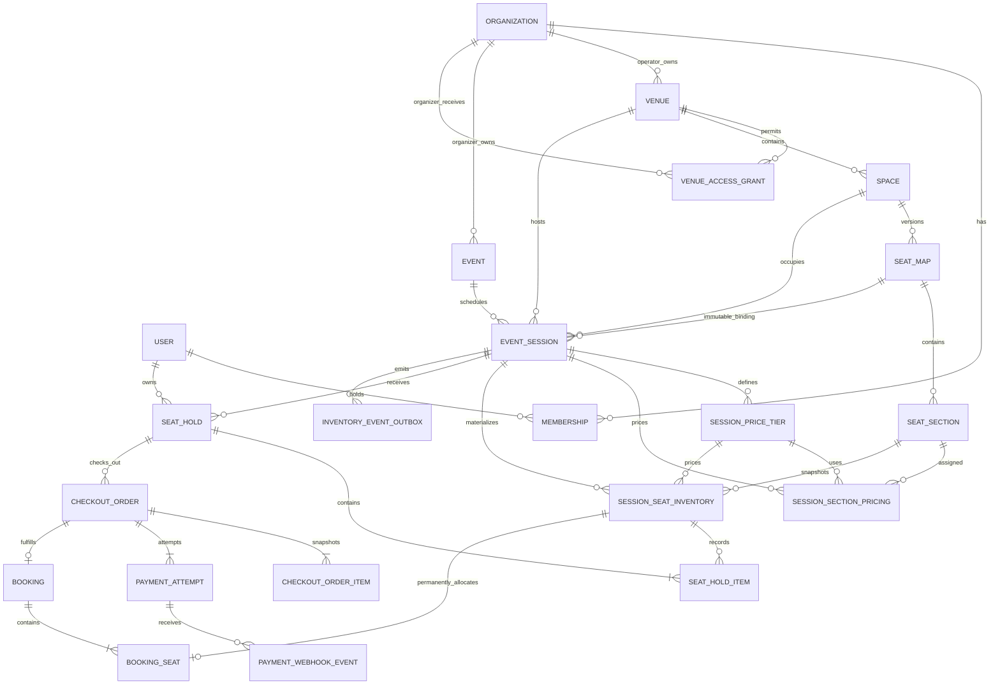

# SeatFlow architecture

## Architectural style

SeatFlow is a modular monolith on Next.js 16 App Router with separate Node worker and realtime processes. `src/app` composes routes and Server Actions, `src/components` owns UI, `src/features` owns Zod and deterministic domain rules, `src/lib` owns request-aware infrastructure, and `src/server` owns framework-light services. Prisma/PostgreSQL is authoritative for identity, tenancy, venue layouts, events, sessions, pricing, per-session inventory, holds, checkout, payment observations, bookings, and the transactional delivery hand-off.

Database and Better Auth clients initialize lazily, so code generation and production builds do not require a live connection. Protected pages and every action perform fresh server-side authorization.

## Phase 3 and Phase 4A relationships

Events belong to organizer organizations. Venues belong to venue-operator organizations. `VenueAccessGrant` is the deliberate relationship between those tenancy boundaries and records both parties, the venue, status, timestamps, and grant/revoke actors. Active duplicates are prevented by a PostgreSQL partial unique index; grant history is append-only.

Event slugs are unique inside their organizer. A stable globally unique public slug combines organizer and event slugs. Sessions store the complete venue/space/map ancestry and the exact published map ID. Database triggers independently verify every ancestry and organization-kind invariant.

## Authorization and validation

Membership capability is always resolved from the current user plus organization identity and kind. Organizer OWNER/ADMIN users manage events; organizer MEMBER is read-only. Venue-operator OWNER/ADMIN users grant or revoke access; operator MEMBER is read-only. Nested event/session/tier/section lookups verify all supplied ancestors, so guessed IDs do not grant capability.

Server Actions parse external input with centralized Zod schemas, then delegate to services. Services re-authorize and transact. PostgreSQL constraints and triggers remain the final line for races or direct writes. Navigation visibility and disabled controls are never treated as authorization.

## Session time and conflict strategy

Browser forms accept venue-local date/time values. A deterministic IANA-time-zone helper converts them to UTC and rejects impossible local times. The database stores UTC-capable PostgreSQL timestamps; rendering always uses the venue's zone.

Session creation and publication check overlaps in application code for useful errors. PostgreSQL's `btree_gist` exclusion constraint enforces non-overlap for every non-cancelled session in one space using `[startAt, endAt)`. A session ending exactly when another starts is therefore legal. Cancelled sessions do not block the range.

## Publication and immutability

Event and session publication are separate. Session publication uses a serializable transaction to reload ancestry, access, times, conflicts, seat-map capacity, tiers, and assignments before changing state. Draft publication becomes `ON_SALE` when the sales window is currently open, otherwise `SCHEDULED`; repeated publication returns the unchanged published session.

Published session venue, space, seat-map, dates, pricing, and assignments are immutable in services and PostgreSQL. Before publication commits, the same transaction materializes inventory and verifies that its row count equals sellable capacity. A newly published seat-map version never retargets an existing session. Restrictive foreign keys keep referenced maps and event/session/hold history. Revoking access blocks new scheduling and draft publication but does not rewrite already published sessions.

## Pricing model

`SessionPriceTier.priceMinor` is an integer and currency is a centralized enum (`AZN`, `EUR`, `GBP`, `USD`). Codes are unique per session and display order is explicit. A batch pricing transaction validates that each tier and section belongs to the same draft session and that every section belongs to the bound map. One `(session, section)` assignment is allowed. Publication requires one currency and complete coverage for every section with active seats; blocked seats are excluded.

## Authoritative inventory and immutable snapshots

`SessionSeatInventory` contains one row for each active physical seat in a priced section of one published session. Materialization derives only from the session's exact immutable map plus `SessionSectionPricing`; blocked or unpriced seats produce no row. `(sessionId, seatId)` is unique. Price tier, price minor units, currency, seat, section, session, and creation identity are immutable after insertion.

`SeatHold` stores owner, session, unguessable public token, idempotency key, server expiry, and lifecycle. `SeatHoldItem` stores immutable historical membership and copies the inventory price snapshot. PostgreSQL checks and triggers enforce state/hold linkage, same-session ancestry, faithful prices, legal lifecycle timestamps, permanent inventory/hold history, and terminal-state immutability. A partial unique index allows at most one active hold per customer per session.

`CheckoutOrder` and `CheckoutOrderItem` form another immutable financial snapshot owned by the same authenticated customer. The order copies session, hold, currency, subtotal, total, expiry, and a public reference; items copy physical seat, inventory, tier, unit price, and currency. Database triggers verify exact ancestry and totals. Client price, currency, total, user, order status, and payment status are not part of the input contract.

## Atomic acquisition and expiry

Hold acquisition accepts only session ID, physical-seat IDs, and an idempotency key. The service derives the authenticated user and reads price, currency, status, sales windows, and expiry from trusted server/database state. Inside one transaction it lazily expires overdue holds, locks the requested inventory rows in deterministic seat order with `SELECT … FOR UPDATE`, rechecks sales eligibility, creates the hold, conditionally changes every row from `AVAILABLE` to `HELD`, and writes all hold items. Any missing, cross-session, blocked, or contended seat aborts the transaction, so no partial selection remains.

Transactions use bounded retry for PostgreSQL deadlock/serialization failures only. Row locks and guarded updates provide the normal contention control; retries never mask validation or availability conflicts. Identical retries return the existing hold when the customer/session/key and exact order-independent seat set match. Reusing the key with a different seat set is rejected.

The default TTL is ten minutes and the default maximum is eight seats. Both are bounded server configuration. Manual owner release and session cancellation release inventory transactionally. Request-time lazy reclamation prevents expired rows from remaining trapped if the sweeper is unavailable. The operations sweeper claims bounded batches with `FOR UPDATE SKIP LOCKED`, so concurrent sweepers partition work safely. Phase 4A does not schedule the command automatically.

## Phase 4B transactional delivery

Every authoritative mutation inserts an `InventoryEventOutbox` row before its PostgreSQL transaction commits. The payload is a strict public invalidation DTO: unique event ID, session ID, event type, and trusted server timestamp. Customer identity, internal ownership, hold tokens, authentication data, and organization data are absent. Unique lifecycle deduplication keys and database lifecycle/size checks protect direct writes.

Dispatchers claim bounded due batches with `FOR UPDATE SKIP LOCKED`. Redis publication uses one Lua operation to set an expiring event-dedup key and append to a bounded Redis Stream atomically. PostgreSQL is marked processed only after delivery succeeds. Redacted failures schedule exponential backoff; the configured final attempt dead-letters the row. A Redis error occurs after the inventory commit boundary and therefore cannot invalidate or roll back a hold.

BullMQ registers one repeatable job, but the job only invokes the existing PostgreSQL sweeper. Redis TTLs never release inventory. Concurrent BullMQ workers remain safe because the database sweeper owns claiming and lifecycle guards.

## Realtime invalidation and refresh

Socket.IO is a standalone gateway consuming the Redis Stream. Web and organizer pages receive short-lived HMAC room tickets only after their public-visibility or tenant-authorization checks pass. Each socket joins one server-derived session room. Connection and subscription limits, exact origin checks, strict event parsing, and fixed key namespaces prevent arbitrary subscription/key injection.

Messages are invalidations, not inventory deltas. A client validates session/event identity, tolerates duplicates and stale order, then fetches a no-store PostgreSQL snapshot. Local selected seats are reconciled against that snapshot. Reconnect, Redis recovery, window focus, and low-frequency disconnected polling all trigger the same authoritative refresh path. The gateway never computes availability.

## Phase 5A payment and booking boundary

Checkout first commits an order and `PaymentAttempt` with a stable provider idempotency key. Only then does the service call the provider, outside a database transaction. A timeout leaves a retryable `CREATED` attempt; the same key produces the same intent on recovery. A provider create/retrieve response can update bounded diagnostic state but can never mark the order paid.

The provider webhook route reads a bounded raw byte body and verifies its signature before parsing or storing normalized fields. The local development/test provider signs `timestamp.rawBody` with HMAC-SHA256 and compares fixed-size digests in constant time. Its deterministic intent and signed success/failure deliveries support automated and browser verification, but configuration rejects it in production. The `EXTERNAL` registry entry is an explicit deployment gate until a reviewed adapter and credentials exist.

Webhook processing persists a unique `(provider, providerEventId)` observation and then locks the webhook, attempt, order, hold, and sorted inventory rows. It checks intent identity, amount, currency, first terminal state, ownership, session ancestry, live hold eligibility, and exact ordered inventory. A verified success atomically:

1. marks the attempt succeeded and order paid;
2. inserts one booking and exactly one booking seat per order item;
3. changes those inventory rows from `HELD` to permanent `BOOKED`;
4. changes the hold from `ACTIVE` to `CONVERTED`;
5. marks the order `FULFILLED` and writes safe outbox invalidations.

Unique constraints and deferred database checks make duplicate or concurrent distinct success events exact once. If payment is verified but fulfillment is unsafe, the order enters paid-unfulfilled/review state with a bounded safe code. Operators can reprocess the stored verified event; no command, redirect, or reconciliation response can fabricate success.

Booked inventory has no transition back to available in Phase 5A. Session cancellation preserves confirmed bookings for future post-payment handling rather than silently refunding or releasing them.

## Phase 5A operations and Redis independence

Bounded commands initialize/retrieve pending provider intents, reprocess an internally stored verified webhook, expire unpaid checkouts, and report stale or paid-unfulfilled records. The admin health route exposes counts only. All booking writes and outbox inserts commit in PostgreSQL before Redis delivery. If Redis is unavailable, booking correctness is unchanged and outbox rows remain pending for the existing retrying dispatcher.

## Public query strategy

Public services query only published events with future eligible sessions. They calculate persisted-domain view models containing earliest session, venue/city, minimum configured price, currency, capacity, and read-only map data. The seat-selection query maps inventory to `AVAILABLE`, `HELD_BY_YOU`, `UNAVAILABLE`, or `BLOCKED`; another customer's hold linkage is never serialized. Invalid, incomplete, cancelled, archived, and unpublished records are filtered out; there is no fixture fallback.

Phase 4B adds Redis transport and real-time invalidation without adding a Redis availability cache. PostgreSQL remains the only source of truth, no-store snapshot handlers read it at request time, and hold creation performs the decisive availability check.

## Testing strategy

- Unit tests cover event/session rules plus sales-window boundaries, hold/checkout/payment lifecycle, integer totals, selection validation, idempotency matching, materialization, safe view models, and availability mapping.
- Component tests cover organizer/customer forms and summaries, coordinate selection states, prices, maximum feedback, pending/conflict behavior, fake-time countdowns, and empty states.
- PostgreSQL tests cover the Phase 0–3 baseline plus materialization, immutable snapshots, ownership, all-or-nothing acquisition, concurrency, idempotency, release, expiry, cancellation, and direct invariant violations.
- Phase 4B PostgreSQL tests cover atomic outbox commit/rollback, every mutation integration, concurrent dispatch claiming, retry/backoff, and dead-letter lifecycle.
- A separate mandatory real-Redis suite covers Streams publication/deduplication, cursor reconnect, signed room isolation, outage/recovery, and multi-worker BullMQ expiry.
- Phase 5A PostgreSQL tests cover ownership, immutable order snapshots, concurrent checkout idempotency, raw webhook verification, amount/currency mismatch, failure, duplicate/concurrent exact-once fulfillment, permanent booked inventory, rollback/reprocess, provider timeout recovery, and paid-unfulfilled outcomes.
- A provider-contract suite covers deterministic create/retrieve/cancel, signed success/failure, delayed/duplicate delivery, tamper rejection, and production gating. The real-Redis suite also proves payment fulfillment commits once during dispatch outage and drains after recovery.
- The integration runners accept only a distinct `TEST_DATABASE_URL`, reset it, and apply the complete append-only migration chain through Phase 5A.
